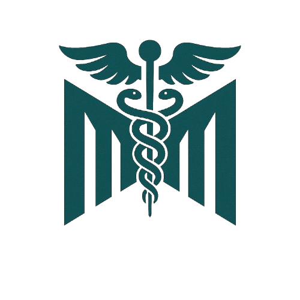

# MedMO: Grounding and Understanding Multimodal Large Language Model for Medical Images

[](https://arxiv.org/abs/XXXX.XXXXX)
[](https://huggingface.co/MBZUAI/MedMO-8B)
[](https://huggingface.co/MBZUAI/MedMO-4B)
[](https://opensource.org/licenses/Apache-2.0)

<p align="center">
  
</p>


**MedMO** is a powerful open-source multimodal foundation model designed for comprehensive medical image understanding and grounding. Built on Qwen3-VL architecture and trained on 26M+ diverse medical samples across 45 datasets, MedMO achieves state-of-the-art performance across multiple medical imaging tasks.

## 🎯 Capabilities

MedMO excels at a comprehensive range of medical imaging tasks:

- **Visual Question Answering (VQA)**: Answer complex questions about medical images across radiology, pathology, ophthalmology, and dermatology
- **Text-Based Medical QA**: Clinical reasoning and medical knowledge question answering
- **Radiology Report Generation**: Generate detailed, clinically accurate radiology reports from medical images
- **Disease Localization with Bounding Boxes**: Precise spatial detection and localization of pathological findings
- **Anatomical Grounding**: Spatial localization and grounding of anatomical structures
- **Clinical Reasoning**: Step-by-step diagnostic reasoning and clinical decision support
- **Diagnostic Classification**: Multi-class disease classification across diverse imaging modalities
- **Spatial Object Detection**: Fine-grained detection in microscopy, pathology slides, and cellular imaging
- **Medical Report Summarization**: Extract and summarize key clinical findings from complex medical reports

### Supported Modalities
- Radiology (X-ray, CT, MRI, Ultrasound)
- Pathology & Microscopy
- Ophthalmology (Fundus, OCT)
- Dermatology
- Nuclear Medicine (PET, SPECT)

## 🚀 Quick Start

### Installation

```bash
pip install transformers torch qwen-vl-utils
```

### Basic Usage

```python
from transformers import Qwen3VLForConditionalGeneration, AutoProcessor
from qwen_vl_utils import process_vision_info
import torch

# Load model
model = Qwen3VLForConditionalGeneration.from_pretrained(
    "MBZUAI/MedMO-8B",
    torch_dtype=torch.bfloat16,
    attn_implementation="flash_attention_2",
    device_map="auto",
)

processor = AutoProcessor.from_pretrained("MBZUAI/MedMO-8B")

# Prepare your input
messages = [
    {
        "role": "user",
        "content": [
            {
                "type": "image",
                "image": "path/to/medical/image.png",
            },
            {"type": "text", "text": "What abnormalities are present in this chest X-ray?"},
        ],
    }
]

# Process and generate
text = processor.apply_chat_template(
    messages, tokenize=False, add_generation_prompt=True
)
image_inputs, video_inputs = process_vision_info(messages)
inputs = processor(
    text=[text],
    images=image_inputs,
    videos=video_inputs,
    padding=True,
    return_tensors="pt",
)
inputs = inputs.to(model.device)

# Generate output
generated_ids = model.generate(**inputs, max_new_tokens=512)
generated_ids_trimmed = [
    out_ids[len(in_ids) :] for in_ids, out_ids in zip(inputs.input_ids, generated_ids)
]
output_text = processor.batch_decode(
    generated_ids_trimmed, skip_special_tokens=True, clean_up_tokenization_spaces=False
)
print(output_text[0])
```

### Example: Disease Localization with Bounding Boxes

```python
messages = [
    {
        "role": "user",
        "content": [
            {"type": "image", "image": "chest_xray.png"},
            {"type": "text", "text": "Detect and localize all abnormalities in this image."},
        ],
    }
]
# Output: "Fractures <box>[[156, 516, 231, 607], [240, 529, 296, 581]]</box>"
```

### Example: Report Generation

```python
messages = [
    {
        "role": "user",
        "content": [
            {"type": "image", "image": "ct_scan.png"},
            {"type": "text", "text": "Generate a detailed radiology report for this CT scan."},
        ],
    }
]
# MedMO generates comprehensive clinical reports with findings and impressions
```

## 🏗️ Model Architecture

MedMO is built on **Qwen3-VL-8B-Instruct** and trained through a 4-stage progressive pipeline:

1. **Stage 1 - General Medical SFT**: Large-scale training on 18.5M image-text pairs for foundational medical understanding
2. **Stage 2 - High-Resolution & Grounding**: Training on 3M curated samples at 1280×1280 resolution for spatial localization
3. **Stage 3 - Instruction Tuning**: Fine-tuning on 4.3M instruction-response pairs for task-specific alignment
4. **Stage 4 - Reinforcement Learning**: GRPO training with verifiable rewards (label accuracy, bbox IoU) for enhanced grounding

**Total Training Data**: 26M+ samples from 45 medical datasets spanning diverse modalities and anatomical systems.

## 📊 Evaluation

### Evaluation Framework

MedMO was comprehensively evaluated using multiple frameworks and metrics:

#### Standard Medical Benchmarks

We used [**MedEvalKit**](https://github.com/alibaba-damo-academy/MedEvalKit) for systematic evaluation across all QA taks:

#### LLM-as-a-Judge Evaluation

For VQAs question answering and report generation tasks, we employed an LLM-as-a-Judge methodology:
- **Judge Model**: gpt-5-mini-2025-08-07

This approach provides robust, scalable assessment of the model's ability to generate detailed, medically accurate long-form responses.


For detailed benchmark results, please refer to our paper.

## 📄 Citation

If you use MedMO in your research, please cite our paper:

```bibtex
@article{deria2025medmo,
  title={MedMO: Grounding and Understanding Multimodal Large Language Model for Medical Images},
  author={Deria, Ankan and Kumar, Komal and Dukre, Adinath Madhavrao and Segal, Eran and Khan, Salman and Razzak, Imran},
  journal={arXiv preprint arXiv:XXXX.XXXXX},
  year={2025},
  institution={Mohamed bin Zayed University of Artificial Intelligence}
}
```

## 🙏 Acknowledgments

We gratefully acknowledge the following:

- **Base Architecture**: Built on [Qwen3-VL](https://github.com/QwenLM/Qwen-VL) by Alibaba Cloud
- **Evaluation Framework**: [MedEvalKit](https://github.com/alibaba-damo-academy/MedEvalKit) by Alibaba DAMO Academy
- **Training Framework**: [TRL](https://github.com/huggingface/trl) (Transformer Reinforcement Learning) by Hugging Face
- **LLM-as-a-Judge**: Evaluation powered by GPT-4o-mini-2025-01-07 from OpenAI
- **Compute Resources**: Training conducted on 64× AMD Instinct MI210 GPUs
- **Open-Source Datasets**: We thank the medical imaging community for providing high-quality public datasets including MedTrinity, MIMIC-CXR, CheXpert, PathVQA, and many others that made this work possible

## 📜 License

This project is licensed under the **Apache License 2.0** - see the [LICENSE](LICENSE) file for details.

## 📧 Contact

For questions, issues, or collaborations:

- **Email**: ankan.deria@mbzuai.ac.ae
